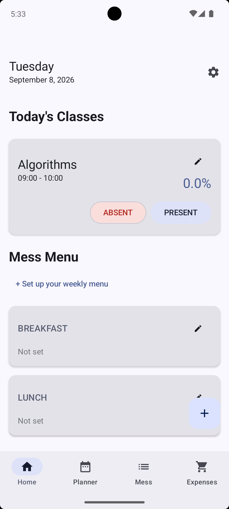
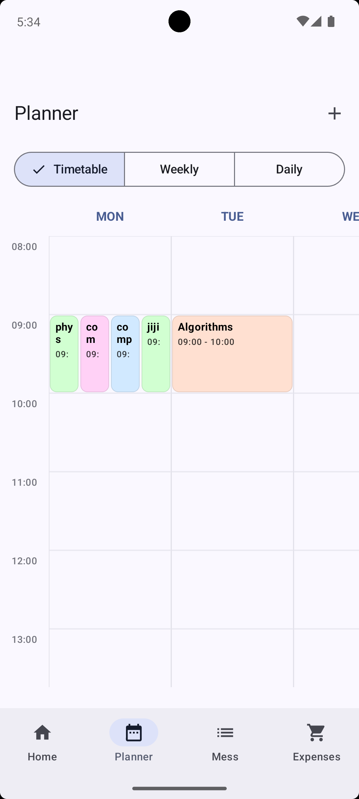
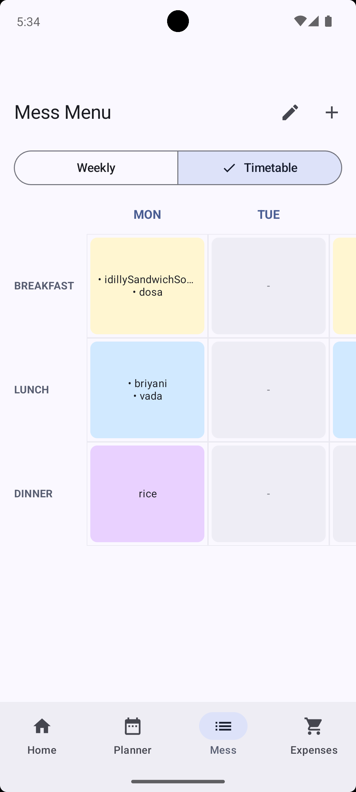
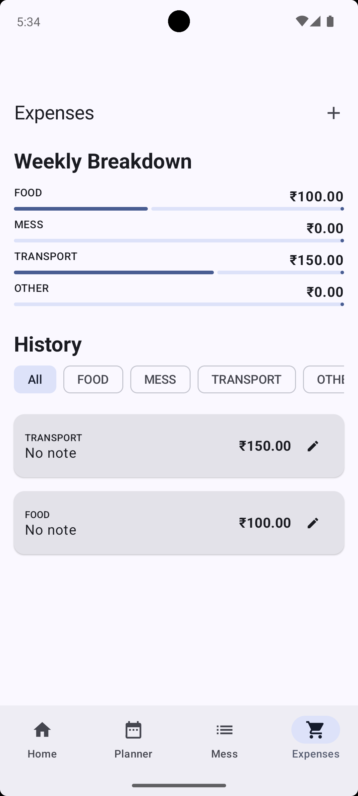

# StudentDaily 🎓

<p align="center">
  
</p>

**A single Android app for the four things a student juggles every day: class schedule, attendance, hostel mess menu, and expenses.**

StudentDaily replaces four separate habits — a timetable app, a mess-menu WhatsApp screenshot, a manual attendance % calculator, and an expense notes file — with one Material 3 app built around a shared daily home screen.

---

## 📸 Screenshots

<p align="center">
  
  
  
  
</p>

---

## ✨ Features

### 🏠 Dashboard (Home)
- At-a-glance summary cards for your **next class** and **today's budget status**
- **Quick Add FAB** to log a class, meal, or expense without switching tabs
- **One-tap attendance toggling** — mark today's presence directly from the home feed (no manual percentage entry)

### 📅 Schedule & Attendance (Planner)
- Full weekly timetable grouped by day
- Automatic, tap-to-mark attendance tracking with live percentage indicators per subject

### 🍽️ Mess Menu (Mess)
- Plan Breakfast, Lunch, and Dinner for the entire week
- **Bulk entry** via a "Full Week Form" to set up the whole menu in one pass

### 💰 Expense Tracker (Expenses)
- Full, date-sorted expense history
- Category filtering (Food, Transport, Fees, etc.) via chips
- Weekly spending breakdown with progress-bar visualizations
- **Real-time budget alerts** at 50%, 75%, 90%, and 100% of your limit

### ⚙️ Settings & Data
- Independent Daily / Weekly / Monthly spending limits
- Configurable notification sound, vibration, and reminder lead time
- Export all data to JSON, or securely reset everything to start fresh

---

## 🏗️ Tech Stack & Architecture

| Layer | Choice |
|---|---|
| Language | Kotlin |
| UI | Jetpack Compose, Material 3 |
| Architecture | MVVM |
| Persistence | Room (with v2 → v3 → v4 migrations) |
| Scheduling | `AlarmManager` for exact class reminders, with `BootReceiver` for reboot persistence |
| Build | Gradle Kotlin DSL |

The app uses a four-tab navigation structure (**Home · Planner · Mess · Expenses**) sharing a common data layer, so an update in one tab (e.g. deleting an expense) is reflected instantly across the rest of the UI.

---

## 📱 Requirements

- Android Studio (recent stable release)
- Android SDK with a target device/emulator running **Android 8.0 (API 26)** or higher
- Runtime permissions for notifications and exact alarms are requested and handled at runtime (tested against Android 15 and Android 16)

---

## 🚀 Getting Started (build from source)

1. **Clone the repository**
```bash
   git clone https://github.com/GOKULNATH20072008/StudentDaily.git
```
2. **Open in Android Studio**
   Open the cloned folder as an existing project and let Gradle sync.
3. **Run**
   Select a device or emulator and hit **Run ▶**.

No backend or API keys are required — all data is stored locally on-device via Room.

---

## 🧪 Beta Testing

**Current version: 0.1.0-beta**

StudentDaily is currently in beta and is being tested on real Android devices.

If you want to test the app:

1. Go to the [Releases](../../releases) page.
2. Download the latest beta APK.
3. Install it on an Android 8.0+ device.
4. Report bugs or suggest features through [Issues](../../issues).

> ⚠️ This is a beta release. Back up exported data before testing major updates.

---

## ✅ Status

**Current release: 0.1.0-beta**

StudentDaily is currently in beta testing. The core timetable, attendance, mess menu, expense tracking, settings, local data persistence, and notification systems are implemented.

The project is actively being tested and improved before a stable 1.0 release.

## 🗺️ Roadmap

- [ ] Spending trend graphs/charts in the Expenses tab
- [ ] Search within Expenses and Planner
- [ ] Custom (non-fixed) expense categories
- [ ] Refined dark/light theming for accessibility
- [ ] Localization — extract hardcoded strings into `strings.xml`
- [ ] Conflict detection for overlapping class times

---

## 🤝 Contributing

This is currently a solo student project built as a daily-use tool. Issues and suggestions are welcome — feel free to open an issue if you spot a bug or have a feature idea.

## 📄 License

No license has been specified yet. All rights reserved by the author unless a license is added.

---

Built by [GOKULNATH20072008](https://github.com/GOKULNATH20072008) — a daily companion app made for students, by a student.
